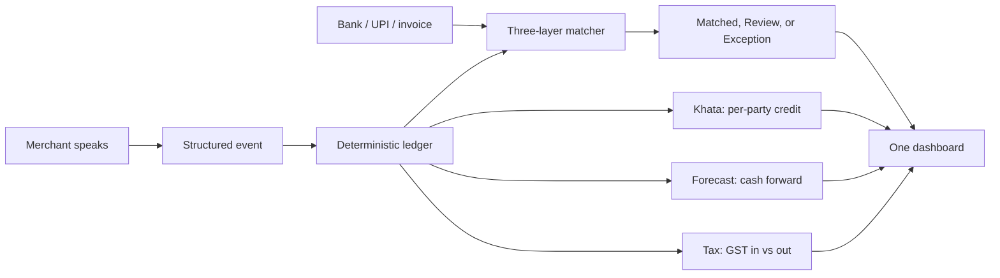
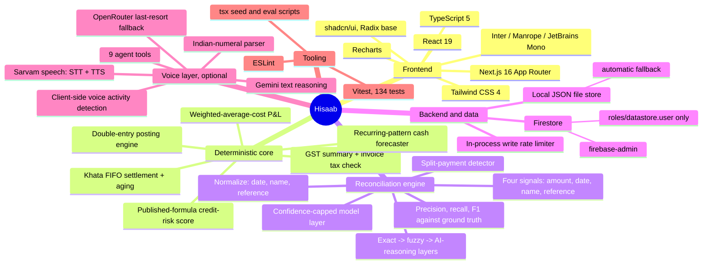
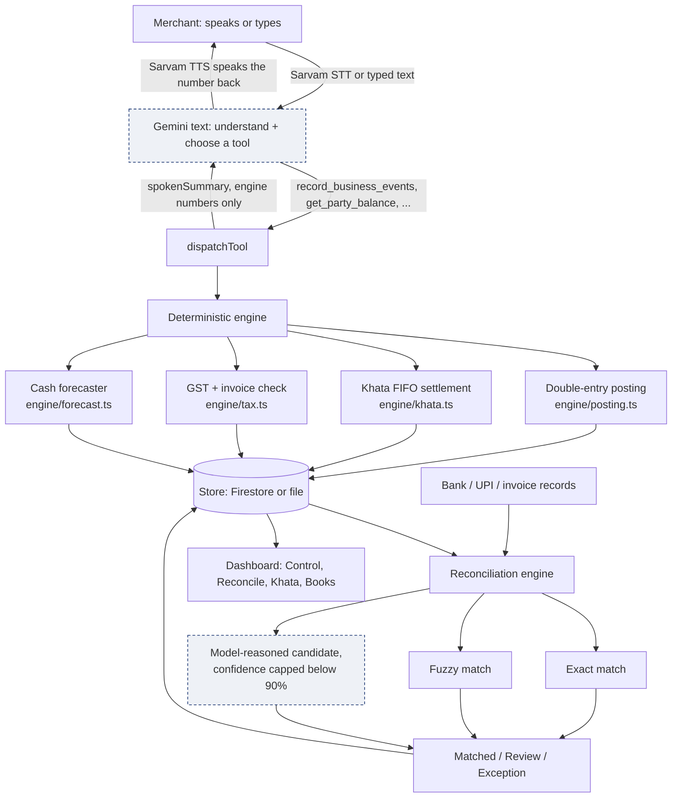
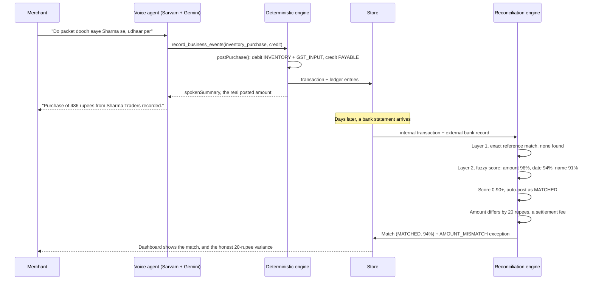

<div align="center">

# Hisaab

*हिसाब. The books, spoken into existence, then checked against the bank.*

[](https://hisaab-hk.vercel.app)
[](https://github.com/harshkawatra11/hisaab/actions/workflows/ci.yml)
[](#testing-and-evaluation)
[](LICENSE)

[](https://nextjs.org)
[](https://www.typescriptlang.org)
[](https://firebase.google.com/docs/firestore)
[](https://www.sarvam.ai)
[](https://ai.google.dev)

[The claim](#the-claim-this-is-built-on) &middot;
[One ledger, not four tools](#one-ledger-not-four-separate-tools) &middot;
[The stack](#a-map-of-the-stack) &middot;
[Architecture](#architecture) &middot;
[The reconciliation loop, visualised](#the-reconciliation-loop-visualised) &middot;
[Voice and the degradation ladder](#voice-and-the-degradation-ladder) &middot;
[Backend deep dive](#backend-deep-dive) &middot;
[Evaluation](#testing-and-evaluation) &middot;
[Run it](#running-it-locally) &middot;
[What broke at 2 AM](#what-broke-at-2-am)

</div>

---

## The claim this is built on

The MSME credit gap in India is estimated at 20 to 25 lakh crore rupees, from the U.K. Sinha
Expert Committee's 2019 report to the RBI. PM SVANidhi has disbursed over 1.12 crore loans worth
17,800 crore rupees to 75.5 lakh street vendors, per the Ministry of Housing and Urban Affairs.
89% of Indian adults own a bank account, yet 16% of those accounts sit inactive, per the World
Bank's Global Findex 2025. These figures establish the size of the informal-credit economy. They
are not a measurement of reconciliation error rates, and no public transaction-level Indian
vendor dataset exists, which is why the data in this build is synthetic and the generator is
documented in full below.

The specific gap this product targets: a small or medium Indian business, a kirana store, a
wholesaler, an MSME, a first-time entrepreneur, a small service or advertising business, that
extends credit to a regular customer, the OkCredit and Khatabook problem space, and keeps that
side of the ledger in a notebook or a phone app that has never once been checked against a bank
statement, a UPI settlement export, or a supplier's invoice. OkCredit and Khatabook already track
a credit ledger well. Neither reconciles that ledger against a bank statement and a payment export
at the same time and shows where they disagree. That is the whole differentiator, stated plainly
rather than as a marketing line. Kirana is the largest and most visible segment of this problem,
not the only one this is built for.

> The four track directions this build answers are not four features bolted together. They are
> four views of one ledger: reconciliation is the ledger checked against outside evidence,
> settlement Q&A is the ledger answering a question, forecasting is the ledger projected forward,
> tax matching is the ledger's GST checked against declared invoices. One dense dashboard makes
> that argument structurally, not just in prose.

---

## One ledger, not four separate tools

A shopkeeper talks. A structured financial event gets created. A deterministic engine posts it
as a double-entry ledger transaction. External evidence, bank lines, UPI settlements, supplier
invoices, arrives from a separate source. A three-layer matcher checks the ledger against that
evidence and reports what it could confidently resolve and what it honestly could not.



Reconciliation, settlement Q&A, cash forecasting and tax matching are not four screens because
they are four different pieces of software. They are four questions asked of the same ledger.

---

## A map of the stack



---

## Technology cards

| Technology | Role here | Where |
| :--- | :--- | :--- |
| **Next.js 16 (App Router, Turbopack)** | Server Components read directly from the store, Route Handlers carry every mutation and the voice/chat boundary | `src/app/`, `src/app/api/` |
| **TypeScript 5** | One `Transaction` / `Match` / `HisaabException` shape shared by the engine, the reconciliation layer, the store, and every UI surface | `src/lib/types.ts` |
| **Tailwind CSS 4** | A dense, ink-on-paper financial design system: 2px radius everywhere, tabular figures on every rupee column, a validated status palette for matched/review/exception state | `src/app/globals.css` |
| **shadcn/ui on Radix** | Tabs, drawer, sheet, table primitives, composed into the dashboard and the reconciliation audit drawer | `src/components/ui/` |
| **Recharts, via shadcn's ChartContainer** | Every chart's colors pass the `dataviz` skill's CVD-separation and lightness-band checks; reconciliation state (matched/review/exception) uses a validated status palette, never a generic categorical hue | `src/components/charts/` |
| **Firestore (`firebase-admin`)** | The production case store, selected automatically once a service account is present, scoped to `roles/datastore.user` only | `src/lib/store/firestoreStore.ts` |
| **Local JSON file store** | The zero-setup fallback: the whole product runs with `npm install && npm run dev`, no cloud account | `src/lib/store/fileStore.ts` |
| **Sarvam (`bulbul:v3` TTS, `saaras:v3` STT)** | The ears and mouth of the voice layer. Speech in, speech out, verified directly against the real sample rate returned rather than assumed | `src/lib/voice/` |
| **Gemini (`generateContent`, native tool calling)** | The brain. Understands the transcript, chooses a tool, reads back a number the engine already computed. Never allowed to compute money itself. `gemini-3.6-flash` primary, `gemini-3.7-flash` second, an OpenRouter free model as a last-resort third tier | `src/lib/gemini/client.ts`, `src/lib/agent/` |
| **Vitest** | 134 tests: every posting function's debit-credit invariant, every reconciliation signal and defect class, the split-payment detector, the Indian-numeral parser, the credit-score formula's bands and clamp, the Gemini fallback chain (including the OpenRouter tier) mocked at the SDK/fetch boundary | `src/**/*.test.ts` |
| **Vercel** | Hosts the live deployment; Firestore and Gemini credentials are set as encrypted project environment variables | this file, deployment section below |

---

## Architecture

The voice and model layer is drawn as a clearly separate, dashed side branch feeding only
understanding and explanation. It never computes money, never decides a reconciliation match,
never calculates GST. That separation is the whole architectural thesis: **the model never
computes money. It calls a tool, and reads back what the deterministic engine already
calculated.**



---

## The reconciliation loop, visualised

The moneyshot flow: a spoken purchase, a bank settlement that arrives days later with a fee
deducted, and the honest exception this produces.



---

## Voice, and why it is a turn loop rather than a single live socket

One click on the sidebar's voice button opens a session built as **listen, think, speak**, a turn
loop across two independently verified providers, not one duplex socket: Sarvam handles speech in
and speech out, Gemini's text model handles the reasoning and the tool calls in between. The agent
speaks first, grounded by a deterministic primer (today's transaction count, credit-sale count,
cash position), never an invented opener. A voice dock shows every tool call as it happens,
`record_business_events -> 3 events posted`, so the mechanism is visible, not hidden behind a chat
bubble, and the status chip names exactly what stage a turn is in: `listening`, `transcribing`,
`thinking`, `speaking`, never a silent gap.

**Why a turn loop, and not Gemini's real-time audio socket.** The repository still contains a
complete, correct Gemini Live implementation (`src/lib/gemini/live.ts`, `src/lib/limits/budget.ts`,
`/api/voice/token`), including a real fix made during this build: ephemeral tokens require the
SDK's `v1alpha` surface, not its default `v1beta`, or the socket opens and silently closes. That
fix is in the code and works. What does not currently work, on this project's Gemini account
specifically, is real-time audio output: two different API keys were each tested directly against
the raw WebSocket, bypassing the SDK entirely to read the true close reason, and each failed for a
different platform-level reason, one with billing credits depleted (`1011`), the other with the
requested `AUDIO` response modality rejected outright (`1007`, a plan-tier restriction, reproduced
identically across two SDK builds and two request shapes). Neither is a code defect. Gemini's text
generation, by contrast, worked immediately and needed no schema conversion, since the app's tool
declarations were already written in Gemini's own native shape. So the brain stayed on Gemini text,
and Sarvam, verified directly against real audio bytes and a real transcript before a line of UI
code was written against it, became the ears and the mouth. The full account of this, in the order
it was actually discovered, is below in ["What broke at 2 AM"](#what-broke-at-2-am).

The turn loop itself, in `src/components/voice/useVoiceSession.ts`:

| Stage | What happens |
| :--- | :--- |
| Listening | Mic streams PCM16 via an `AudioWorkletProcessor`; client-side RMS energy detects speech, then silence, to end the turn without a fixed timer |
| Transcribing | The turn's audio posts to `/api/voice/stt`, a thin server route wrapping Sarvam `saaras:v3` |
| Thinking | The transcript goes to `/api/chat`, the same tool-calling loop the typed chat uses, against `generateWithFallback()`: `gemini-3.6-flash`, then `gemini-3.7-flash`, then one last-resort OpenRouter call, in that order, only advancing to the next tier on a real failure or an empty response |
| Speaking | The reply text posts to `/api/voice/tts` (Sarvam `bulbul:v3`), decoded at whatever sample rate the response actually carries, never a hardcoded guess, and played through the existing gapless queue |

**Barge-in.** If voice activity is detected while the agent is speaking, playback stops immediately
and a new turn opens, so an interruption feels like a real conversation rather than a wait.

**Latency is real and stated plainly, not hidden.** A turn crosses two providers and typically
lands in single-digit seconds; `thinkingConfig.thinkingLevel: "LOW"` on every Gemini call is what
keeps it there, cutting an identical tool-calling request from 277 seconds to 3.5 seconds in direct
testing, since a tool-dispatching agent does not need deep reasoning to choose which function to
call.

Spoken Indian quantities, `dhai`, `sava`, `derh`, `paune`, `bara sau`, `lakh`, `crore`, are
resolved by a deterministic parser (`src/lib/agent/numerals.ts`) before they ever reach the
posting engine, and a plain digit string (`"2"`) is accepted outright as exact rather than forced
through word-form parsing. A model that mishears `dhai kilo` as `2 kilo` posts a wrong ledger
entry, and no amount of prompt engineering makes that safe, so the parser rejects an unrecognised
phrase outright rather than guessing.

---

## Backend deep dive

**The store router.** Every route, action and dashboard query imports persistence from
`src/lib/store.ts`, a thin router over two interchangeable backends behind one `HisaabStore`
interface (`src/lib/store/types.ts`):

- `src/lib/store/firestoreStore.ts`, used automatically once `FIREBASE_PROJECT_ID`,
  `FIREBASE_CLIENT_EMAIL` and `FIREBASE_PRIVATE_KEY` are present.
- `src/lib/store/fileStore.ts`, the zero-setup fallback, writing to `.data/hisaab.json` locally
  and `/tmp` on Vercel.

**The deterministic finance engine never delegates a calculation.** Every posting function in
`src/lib/engine/posting.ts` asserts `sum(debits) === sum(credits)` before returning, and that
invariant is exercised across 200 randomized postings of every transaction type in
`posting.test.ts`. That assertion is the literal, testable basis for the claim "the books
balance."

**The reconciliation engine's three layers.** Layer 1 matches on an exact reference and exact
amount. Layer 2 scores every candidate on four weighted signals, `0.40 * amount + 0.20 * date +
0.25 * name + 0.15 * reference`, auto-posting above 90% confidence and flagging 72 to 90% for
review. Layer 3 only ever sees the candidates Layer 2 already produced, may only return an id
from that list, and has its confidence clamped to a hard maximum of 0.89 in code
(`src/lib/recon/match.ts`, `AI_CONFIDENCE_CAP`), so **a model decision can never auto-post as
MATCHED.** It always lands as a REVIEW row with its reasoning attached, for a human to accept.

**The split-payment detector.** A settlement paid in two separate transfers cannot be resolved
by any 1:1 matcher, by construction. `src/lib/recon/splitPayments.ts` looks for a same-
counterparty, close-in-date pair of external records whose sum equals one unmatched internal
transaction, and raises one honest `SPLIT_PAYMENT_SUSPECTED` exception rather than two misleading
unmatched rows. It catches most, not all, of the injected cases, and that shortfall is reported,
not hidden.

**Cost safety on Firestore**, mirroring the layered approach used elsewhere: the Spark free tier
itself (50,000 reads, 20,000 writes, 20,000 deletes a day), a service account scoped to exactly
`roles/datastore.user`, and an in-process write rate limiter (`src/lib/firestore/rateLimit.ts`,
30 writes per minute per instance) as a backstop against a scripted loop, which matters more here
than in a typical CRUD app since one spoken sentence can post several transactions at once.

---

## Testing and evaluation

**134 tests**, `npm run test`: every posting function's balance invariant, every reconciliation
signal and every injected defect class with its own fixture, the split-payment detector, FIFO
khata settlement and aging-bucket boundaries at exactly 7, 15 and 30 days, the recurring-pattern
detector on a synthetic weekly restock, the GST mismatch threshold, the Indian-numeral parser
across Latin and Devanagari forms including plain digit strings, a multi-item voice order for one
customer resolved end to end against a seeded catalog, and the Gemini model fallback chain,
including its OpenRouter last-resort tier, mocked at the SDK and fetch boundary.

**A real evaluation harness**, `npm run eval`, runs the exact reconciliation pipeline the app
uses against a deterministic, seeded 90-day synthetic dataset (784 internal transactions, 166
external records across bank, UPI and invoice sources) with documented defects and machine-
readable ground truth:

| Loop | Internal | External | Matched | Review | Exceptions | Match rate | Precision | Recall | F1 |
| :--- | ---: | ---: | ---: | ---: | ---: | ---: | ---: | ---: | ---: |
| Settlement (bank/UPI) | 96 | 106 | 67 | 10 | 61 | 69.8% | 98.5% | 84.6% | 91.0% |
| Invoice (tax-line) | 64 | 60 | 60 | 0 | 10 | 93.8% | 90.0% | 100.0% | 94.7% |

Read the settlement row plainly: a naive "match rate" alone can be gamed by matching nothing and
calling everything an exception, 100% exceptions, 0% false matches, looks safe, is useless. This
harness reports precision and recall against ground truth specifically so that gaming is visible.
84.6% recall on the settlement loop means roughly one in six genuine matches was missed, mostly
by design: of the 6 split-payment cases deliberately injected, the dedicated detector catches 5
and reports the sixth as a plain unmatched exception rather than a wrong match. That is a stated
limitation, not a hidden one, and both numbers are published because a system that only reports
its successes is not trustworthy, and this one is asked to make money-adjacent decisions.

**The injected defect distribution**, generated by `src/lib/seed/generator.ts` and documented in
full in the app's own Methodology sheet: clean exact matches, counterparty name variants,
settlement lag of 1 to 4 days, settlement fee deltas of 2 to 40 rupees, duplicate records,
missing counterpart records, unrelated noise transactions, incorrect GST on six invoices, and six
split-payment cases. Every number above is reproducible: the generator is seeded (`SEED =
20260903`), so a fresh clone produces the identical dataset and the identical scores.

---

## Running it locally

```bash
npm install
npm run dev
```

Open `http://localhost:3000`. No cloud account, no API key, no setup beyond `npm install` is
required: the double-entry engine, khata, tax, forecast and reconciliation are all deterministic
code, and data is stored in a local JSON file created automatically on first run.

```bash
npm run seed     # generates the deterministic synthetic dataset and seeds the store
npm run test     # 122 tests
npm run eval     # reconciliation measured against the seeded ground truth
npm run build    # production build
npm run verify   # lint + typecheck + test + build, in that cheapest-first order
```

### Optional: voice and chat

```bash
cp .env.example .env.local
```

Fill in `GEMINI_API_KEY` from [Google AI Studio](https://aistudio.google.com/apikey) for text
reasoning, and `SARVAM_API_KEY` from [Sarvam AI](https://www.sarvam.ai) for speech in and out.
`OPENROUTER_API_KEY` is optional, a last-resort fallback if every Gemini model fails. Without
`GEMINI_API_KEY`, the voice button and chat both show a clear inline message rather than failing
silently, the same state the automated test suite runs against.

### Optional: Firestore persistence

Set `FIREBASE_PROJECT_ID`, `FIREBASE_CLIENT_EMAIL` and `FIREBASE_PRIVATE_KEY` from a service
account scoped to `roles/datastore.user`. Without these three set, the app falls back
automatically to the local file store described above. On Vercel specifically, the file store
writes to `/tmp`, which is ephemeral and not shared across serverless instances, so Firestore is
the real path for a persistent live deployment; the file store there exists so the build works
end to end even before those credentials are configured.

---

## Deployed on Vercel

**Live at [hisaab-hk.vercel.app](https://hisaab-hk.vercel.app)**, connected directly to
this repository's GitHub integration, building and promoting to production on every push to
`master`. `src/lib/store.ts` selects Firestore automatically once the three `FIREBASE_*`
variables are present as encrypted Vercel project environment variables.

### Backend: Firestore on GCP

GCP project `hisaab-hackathon-2026`, region `asia-south1` (Mumbai), Firestore Native mode,
Spark free tier (50,000 reads, 20,000 writes, 20,000 deletes per day). Service account
`hisaab-store@hisaab-hackathon-2026.iam.gserviceaccount.com` is scoped to exactly
`roles/datastore.user`, the minimum permission needed to read and write documents: it
cannot create resources, cannot access billing, and cannot touch any other GCP service even
if the key were compromised. The three credential fields are stored as encrypted Vercel
project environment variables, not in the repository.

---

## CI/CD

`.github/workflows/ci.yml` runs on every push and pull request to `master`: lint, then test,
then `next build`. Cheapest step first, so a lint failure does not waste minutes on a build.
`next build` is used instead of standalone `tsc --noEmit` because Next.js generates ambient
route types as a side effect of the build; a clean CI checkout without a prior `next dev` run
would fail standalone typecheck on those generated types.

Vercel's Git integration deploys independently of the GitHub Actions pipeline: a push to
`master` triggers both simultaneously. To reproduce the full gate locally: `npm run verify`.

---

## What this system decides, what it merely proposes

| Concern | Deterministic code | Language model |
| :--- | :--- | :--- |
| Money calculation and every ledger posting | Decides, always | Never |
| Reconciliation match decision | Decides, always | Never |
| Match confidence at or above 90%, the auto-post line | Decides, always | Cannot cross this line, hard-capped in code |
| Ambiguous counterparty candidate (72-90% band) | Presents the candidate list | May propose one, capped at 89%, never auto-posted |
| GST and tax arithmetic | Decides, always | Never |
| Forward cash forecast | A transparent recurrence model over the merchant's own history | Never |
| Credit-risk score (0-100) | A published formula over aging, lateness and exceptions, always | Never, only reads the number back |
| Speech understanding, event structuring, explanation | Sets the tool contract the model must call into | Understands, chooses, phrases |

The rule stated plainly: a model may listen, structure speech into a typed event, and explain a
result in the merchant's own words. It may never compute a rupee figure or decide a
reconciliation match.

---

## What is covered, and what is not

No live UPI rails, no NPCI membership, no Account Aggregator access, no bank core write access:
only a regulated entity can transact on those rails, and this build is not a licensed financial
institution. The reconciliation loop runs against documented synthetic bank, UPI and invoice data,
generated by a seeded script rather than presented as real. This is not an accounting system of
record and not tax advice.

The app runs as a single demo merchant with no sign-in. The store layer already takes and checks
an owner id on every read and write (`ownerUid`, checked inside the store, not trusted from the
caller), so real authentication is a change to one constant's call sites (`src/lib/owner.ts`)
rather than a change to every route later. WhatsApp settlement reminders, visible as a badge on
the Khata screen, are a stated data boundary rather than an unfinished feature: a real send needs
a live phone number and a live bank feed, and this build runs on seeded data, so the badge says
exactly that rather than claiming a broken control.

---

## What broke at 2 AM

The voice agent is the whole product. A shopkeeper who cannot read a dashboard can still talk to
it. And for a stretch of this build, it never spoke: every session came back with the same calm
message, voice unavailable, type instead.

**The first two suspects were both wrong.** The hardest failure looked most likely first: four
Gemini Live model ids hardcoded in the client, probably renamed or deprecated. Checked against the
live API with a real key, all four were current and correct. Next suspicion: the degrade-to-typed
fallback swallowing a thrown error. It was not. It was the first branch of the token route,
behaving exactly as written, because there was no `.env.local` in the repository at all, locally,
ever. Adding one fixed the token mint immediately.

**Reading code would never have found what came next.** Driving a headless browser at the running
app and logging every WebSocket frame surfaced two real defects: the SDK warned that ephemeral
tokens only work on the `v1alpha` surface while the client connected on the default `v1beta`, so
the socket opened and closed with nothing shown to the user, and the playback code set status to
"speaking" on every audio chunk and never set it back. Both fixed. The socket still closed,
silently, instantly.

**Connecting raw, outside the browser and the SDK, finally read the real close frame the
abstraction had been hiding:** `code 1011, "Your prepayment credits are depleted."` Not a bug. A
billing account with nothing left in it, on every Gemini surface, text generation included.

**A second key told a more interesting story than "problem solved."** Text generation worked
immediately, first try, on the real sentence a shopkeeper would actually say. Live's real-time
audio output did not: the socket opened, then closed with a different code, `1007`, rejecting a
request that plainly asked for audio, routed to a model name neither of us had seen before.
Reproduced identically across two SDK builds and two config shapes. Not a bug in the code a second
time either, a plan-tier restriction on real-time audio output, distinct from the first key's
billing problem, on a surface with no lever to pull from this side.

**How we got out, twice in one session.** The product was built so the model was never
load-bearing: every rupee is computed by deterministic code, the model only listens, chooses a
tool, and reads back what the engine already calculated. That decision, made weeks earlier for
correctness reasons, turned two dead ends into an afternoon of work instead of a rewrite, twice.
Gemini stayed for reasoning, since it was the piece that actually worked. Sarvam, verified directly
against real audio bytes before a line of UI code was written against it, replaced only the parts
that did not work, speech in and speech out. A third provider tried for voice along the way gated
its text-to-speech behind a paid plan, found out the same way, by testing it before building on it,
and was removed from the codebase entirely rather than left dormant. The tool schema Gemini already
used needed no rewrite at all, because it was already correct.

**What we took from it.** Check the boring explanation before the interesting one. A missing
config file, a depleted account, and a plan-tier limit all look identical from outside the system,
and only the actual API response tells you which one you are looking at. Every abstraction that
turns a failure into a friendly message is a place a real error goes to hide, so make it loud
somewhere. Verify a provider directly, with a real request, before writing a line of code against
it, because two different providers cost real time by looking fully configured right up until the
one call that mattered returned 402 or 1007. And keep the model out of the load-bearing path,
because the day a provider disappears is the day you find out whether you built a product or a
wrapper around someone else's API staying up.

---

## License

Apache License, Version 2.0. See [`LICENSE`](LICENSE).

<div align="center">

*The merchant talks. The books check themselves.*

</div>
